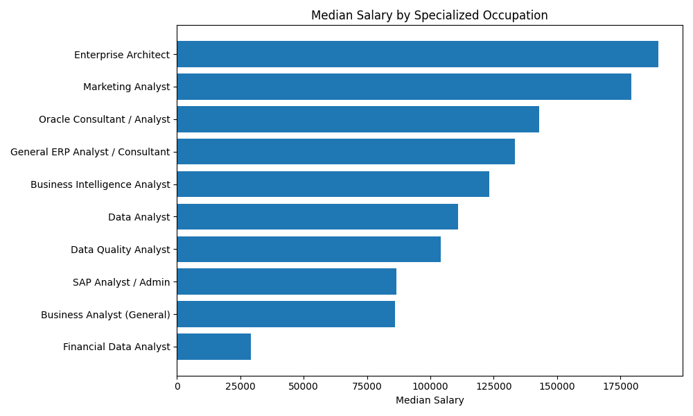
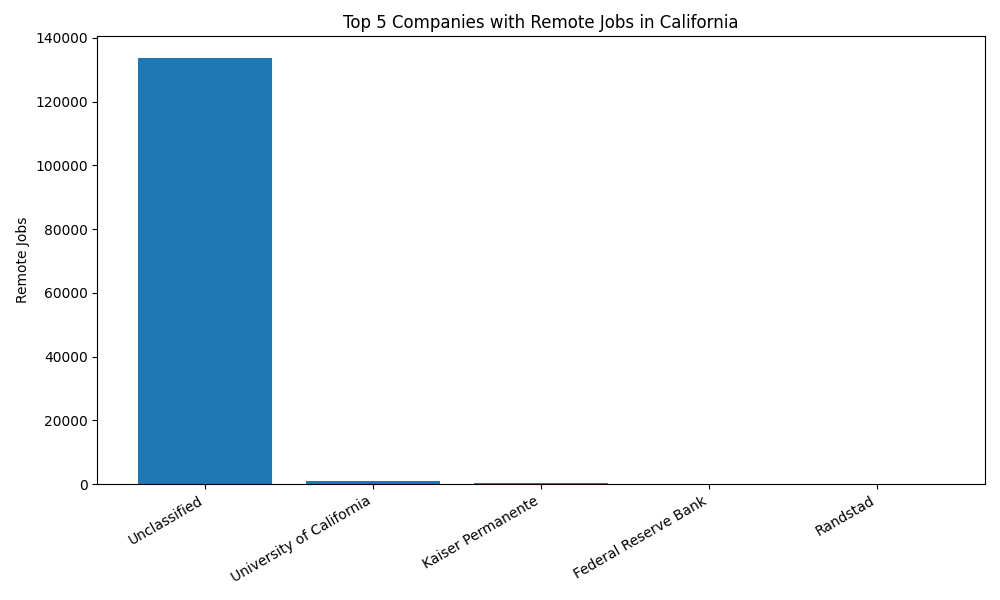
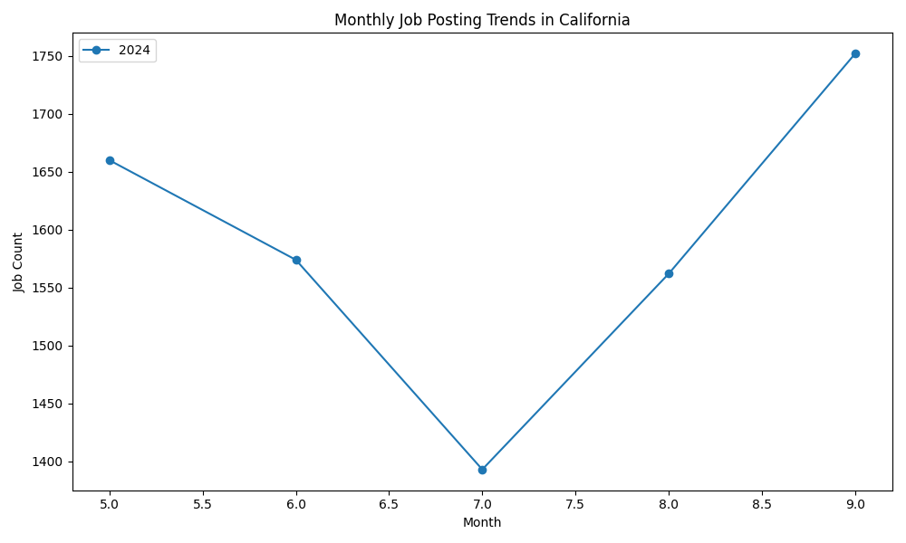
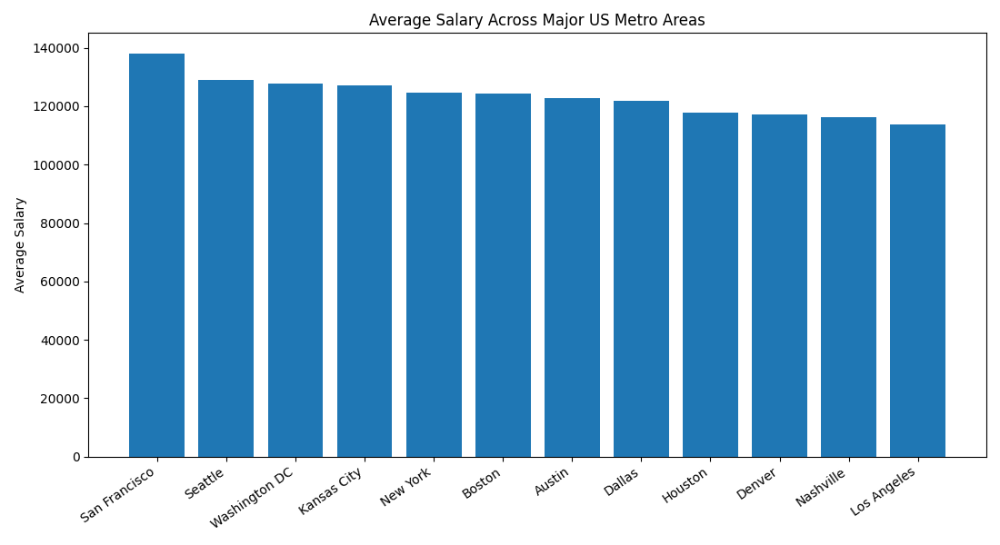

# Module 2 Assignment: Spark SQL and DataFrames

GitHub Repository URL: https://github.com/wenlutong199-oss/wenlutong199.github.io

This assignment uses Spark SQL to create relational tables from the Lightcast job postings dataset and analyze job roles, salaries, remote work, and location trends.

## Relational Tables
The analysis created four relational tables: job_postings, companies, industries, and locations. The job_postings table uses foreign keys to connect postings with company, industry, and location information.

## Query 1: Industry-Specific Salary Trends
The first query focuses on the technology industry and calculates median salaries by specialized occupation. Higher median salaries suggest stronger compensation for certain specialized roles.

## Query 2: Top Remote Companies in California
The second query identifies the top five companies with the most remote job postings in California.

## Query 3: Monthly Job Posting Trends in California
The third query shows how job postings in California change by month and year.

## Query 4: Salary Comparisons Across Major US Cities
The fourth query compares average salaries across selected major metropolitan areas.

